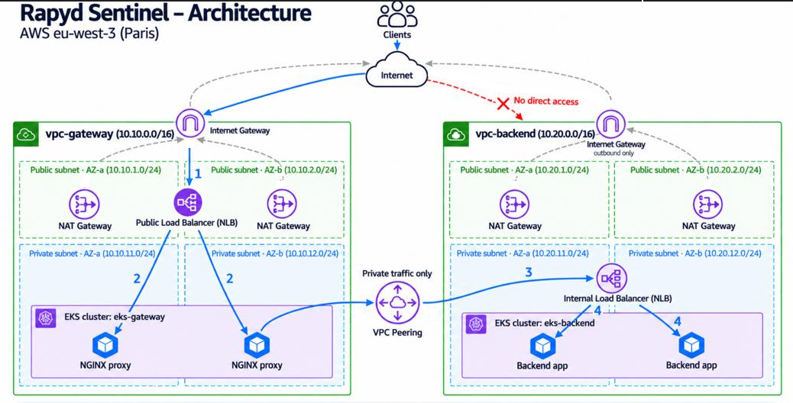

# Rapyd Sentinel

Rapyd Sentinel is an imaginary threat intelligence platform. This repository is a **proof of concept (PoC)** of its infrastructure, built for the Rapyd DevOps technical challenge "Sentinel Split Architecture".

The platform is split into two isolated domains:

- **Gateway layer (public):** hosts the internet-facing proxy that receives client traffic.
- **Backend layer (private):** runs the internal service and is never exposed to the internet.

Each domain has its own network and its own Kubernetes cluster, and the two talk to each other privately.

## Contents

- [Architecture](#architecture)
- [What gets built](#what-gets-built)
- [Tech stack](#tech-stack)
- [Repository layout](#repository-layout)
- [How to clone and run the project](#how-to-clone-and-run-the-project)
- [How networking is configured between VPCs and clusters](#how-networking-is-configured-between-vpcs-and-clusters)
- [How the proxy reaches the backend](#how-the-proxy-reaches-the-backend)
- [CI/CD pipeline overview](#cicd-pipeline-overview)
- [Design decisions and trade-offs](#design-decisions-and-trade-offs)
- [Trade-offs and limitations](#trade-offs-and-limitations)
- [What I would have improved or added next](#what-i-would-have-improved-or-added-next)
- [Project documents](#project-documents)

## Architecture



## What gets built

Everything runs in AWS region **eu-west-3 (Paris)** and is created by Terraform through GitHub Actions.

| Layer | Network | Kubernetes cluster | Workload |
|---|---|---|---|
| Gateway | `vpc-gateway` (10.10.0.0/16) | `eks-gateway` | NGINX reverse proxy behind a public Network Load Balancer |
| Backend | `vpc-backend` (10.20.0.0/16) | `eks-backend` | Simple web service that answers `Hello from backend`, behind an internal Network Load Balancer |

Both VPCs have two public and two private subnets across two Availability Zones, an Internet Gateway, and one NAT Gateway per AZ. The worker nodes (2 x `t3.medium` per cluster) live only in private subnets and have no public IP addresses. The two VPCs are connected with VPC peering.

## Tech stack

- **AWS:** VPC, EKS (managed node groups), NAT and Internet Gateways, Network Load Balancers, VPC peering, IAM, S3
- **Terraform:** reusable modules for networking, peering and EKS, composed by one environment
- **Kubernetes:** plain manifests for the backend and the gateway
- **GitHub Actions:** validation, plan, apply, workload deployment and tests, authenticated to AWS with OIDC

## Repository layout

```
.github/workflows/    CI and deployment pipelines (ci, deploy, bootstrap, destroy)
terraform/
  modules/
    network/          VPC, subnets, route tables, NAT and Internet Gateways
    peering/          VPC peering connection and cross-VPC routes
    eks/              EKS cluster, node group, IAM roles, access entries
  envs/poc/           The environment that wires the modules together
k8s/
  backend/            Backend manifests
  gateway/            Gateway manifests (templates filled in at deploy time)
scripts/              Bootstrap, manifest rendering and exposure checks
docs/                 Project log: progress, results and findings
```

Each Terraform module has typed, validated inputs and explicit outputs (`variables.tf`, `outputs.tf`). `envs/poc` is the only place where the modules are connected: the network module outputs (VPC IDs, subnet IDs, private route table IDs) feed the peering and EKS modules.

## How to clone and run the project

This section is for whoever reviews the project. **You do not need to change anything**: the AWS account, region, resource names, Terraform state bucket, deploy role and GitHub secrets are already set up. You only start the workflow and check the result. Everything is created by GitHub Actions; nobody runs `terraform apply` on a laptop.

### 1. Clone

```bash
git clone https://github.com/damvp0320/rapyd-sentinel.git
cd rapyd-sentinel
```

Cloning is only needed to read the code or run the optional local checks (step 5). The pipeline runs in GitHub, in this repository, and needs write access to the repository to start workflows.

### 2. Run the pipeline

**From the GitHub website:** open the **Actions** tab, select the **deploy** workflow, click **Run workflow**, keep the branch `main` and confirm.

**From the command line** (GitHub CLI, logged in with `gh auth login`):

```bash
gh workflow run deploy.yml --ref main
gh run watch
```

A push to `main` runs the same pipeline. A push to any other branch only runs the checks and a Terraform **plan**; it changes nothing in AWS.

### 3. Check the result

A green `deploy` run means every step passed, including the end-to-end test. The job summaries show the Terraform plan and outputs, the addresses of both load balancers, the request that returned `Hello from backend`, and six PASS lines of exposure checks.

If the infrastructure already exists (it may, from the author's last run), Terraform reports `No changes` and the whole run takes a few minutes; this is the expected result of a repeat run. To watch everything being created from nothing, run the **destroy** workflow first (step 4) and then **deploy** again. A full creation takes about 15 to 20 minutes, mostly the two EKS clusters.

To call the system yourself (needs AWS CLI access to the account and `kubectl`):

```bash
aws eks update-kubeconfig --region eu-west-3 --name eks-gateway
HOST=$(kubectl -n sentinel get svc gateway -o jsonpath='{.status.loadBalancer.ingress[0].hostname}')
curl http://$HOST/
```

Expected output:

```
Hello from backend
```

### 4. Tear everything down

```bash
gh workflow run destroy.yml -f confirm=destroy
gh run watch
```

Or in the Actions tab: **destroy** > **Run workflow** > type `destroy`. It deletes the Kubernetes load balancers first (they would block the VPC deletion) and then runs `terraform destroy`. The state bucket and the deploy role are created once by the bootstrap and are not removed. While running, the environment costs roughly two EKS control planes, four NAT Gateways and four small nodes, so destroy it when you are done.

### 5. Optional: run the checks locally

No AWS credentials needed. On macOS: `brew install hashicorp/tap/terraform terraform-linters/tap/tflint`.

```bash
terraform fmt -check -recursive terraform
cd terraform/envs/poc
terraform init -backend=false
terraform validate
tflint --config ../../../.tflint.hcl
```

### Good to know

- **It runs in this repository.** The AWS deploy role only trusts this repository, so a fork cannot sign in to AWS with it. This is intentional.
- **It needs the challenge AWS account.** If the account or its role has been closed or cleaned up, the `plan` job fails when signing in to AWS.
- **A stale plan is not an error to fix.** If `apply` says `Saved plan is stale`, start a new **deploy** run instead of re-running the old one.
- **The end-to-end test retries for up to 10 minutes** because a new load balancer can take a few minutes to start answering.

## How networking is configured between VPCs and clusters

### The two VPCs

| | `vpc-gateway` | `vpc-backend` |
|---|---|---|
| CIDR | 10.10.0.0/16 | 10.20.0.0/16 |
| Public subnets (NAT Gateways, internet-facing load balancer) | 10.10.1.0/24 (AZ-a), 10.10.2.0/24 (AZ-b) | 10.20.1.0/24 (AZ-a), 10.20.2.0/24 (AZ-b) |
| Private subnets (worker nodes, internal load balancer) | 10.10.11.0/24 (AZ-a), 10.10.12.0/24 (AZ-b) | 10.20.11.0/24 (AZ-a), 10.20.12.0/24 (AZ-b) |
| Availability Zones | eu-west-3a, eu-west-3b | eu-west-3a, eu-west-3b |

The CIDRs do not overlap, which is a requirement for peering. There are no public EC2 instances: the only things in the public subnets are NAT Gateways and, in the gateway VPC, the public load balancer.

### Internet Gateways and NAT Gateways

- **Internet Gateway (one per VPC):** the door between the VPC and the internet. In `vpc-gateway` it also carries inbound client traffic to the public load balancer. In `vpc-backend` it exists only so the NAT Gateways can reach the internet; nothing inbound is allowed and the private subnets have no route to it.
- **NAT Gateway (one per AZ in each VPC, four in total):** lets the private worker nodes start connections to the internet (pulling container images, calling AWS APIs) without being reachable from it. Each private subnet routes through the NAT Gateway in its own AZ, so losing one AZ does not cut outbound access of the other.

### Route tables

| Route table | Destination | Target |
|---|---|---|
| `vpc-gateway-public`, `vpc-backend-public` | 0.0.0.0/0 | the VPC's Internet Gateway |
| `vpc-gateway-private-eu-west-3a` / `-3b` | 0.0.0.0/0 | NAT Gateway in the same AZ |
| | 10.20.0.0/16 | VPC peering connection |
| `vpc-backend-private-eu-west-3a` / `-3b` | 0.0.0.0/0 | NAT Gateway in the same AZ |
| | 10.10.0.0/16 | VPC peering connection |

### VPC peering

`vpc-gateway-to-vpc-backend` is a single peering connection (same account, same region, auto-accepted) between the two VPCs. The `peering` module adds a route to every private route table on both sides, so a pod in either private subnet can reach the other VPC. Public route tables are deliberately not touched. Traffic over the peering link stays on the AWS private network.

### Kubernetes clusters

- `eks-gateway` runs in `vpc-gateway` and `eks-backend` in `vpc-backend`, each with a managed node group (2 x `t3.medium`, Amazon Linux 2023) in the two private subnets.
- The subnets carry the `kubernetes.io/role/elb` (public) and `kubernetes.io/role/internal-elb` (private) tags, so Kubernetes places internet-facing load balancers in public subnets and internal ones in private subnets.
- Cluster access uses EKS access entries (no `aws-auth` ConfigMap). Admin rights are granted explicitly to the CI role and one operator.

### Security groups

Each cluster uses the cluster security group that EKS creates and attaches to its nodes.

- **Backend nodes:** inbound only from the gateway VPC (`10.10.0.0/16`) on the NodePort range, plus load balancer health checks from the backend's own private subnets. Nothing is open to `0.0.0.0/0`. The restriction is enforced twice: an explicit Terraform rule, and Kubernetes `loadBalancerSourceRanges: 10.10.0.0/16` on the backend Service.
- **Gateway nodes:** only the public load balancer's port is open to the internet, which is the intended public entry point.

The pipeline checks this on every run (see [CI/CD](#cicd-pipeline-overview)).

## How the proxy reaches the backend

The path of one request, numbered as in the diagram:

1. **Client to the public load balancer.** The client calls the public Network Load Balancer (internet-facing, in the gateway VPC's public subnets) over the Internet Gateway.
2. **Load balancer to an NGINX pod.** The load balancer forwards to one of the two NGINX proxy pods in `eks-gateway`.
3. **NGINX to the backend over the peering link.** NGINX forwards the request to the DNS name of the backend's **internal** Network Load Balancer. NGINX resolves it through the VPC resolver (`10.10.0.2`) at request time, and the name resolves to private addresses in `10.20.11.x` / `10.20.12.x`. The gateway private route tables send `10.20.0.0/16` to the peering connection, so the request crosses to `vpc-backend` without touching the internet.
4. **Internal load balancer to a backend pod.** The internal load balancer, which exists only in the backend's private subnets, forwards to one of the two backend pods, which answer `Hello from backend`. The answer returns along the same path.

**How the gateway learns the backend address.** The internal load balancer's DNS name only exists after the backend is deployed. The pipeline deploys the backend first, waits until its Service has a hostname, and passes it to the gateway job. `scripts/render-gateway.sh` fills it into the gateway templates (`*.yaml.tpl`) with `envsubst` before they are applied. The hostname is also written as a pod annotation, so a changed address restarts the gateway pods automatically.

**Why plain Kubernetes Services.** A `LoadBalancer` Service with the NLB annotations creates both load balancers through EKS's built-in support, using only the cluster IAM role. No extra controller or IAM roles were needed, which suited the restricted permissions of this account.

## CI/CD pipeline overview

Four GitHub Actions workflows in `.github/workflows/`:

| Workflow | Trigger | What it does |
|---|---|---|
| `ci` | every push and pull request | `terraform fmt -check`, `terraform validate` for every module and the environment, `tflint` (recommended preset), `kubeconform` on the Kubernetes manifests. No AWS access. |
| `deploy` | every push (docs-only changes ignored) and manual run | The full pipeline below. Apply and deployment run only on `main`. |
| `bootstrap` | manual, one time | Creates the Terraform state bucket and the deploy role, and prints PASS/DENIED for each permission it tests. |
| `destroy` | manual, requires typing `destroy` | Deletes the Kubernetes load balancers, then runs `terraform destroy`. |

**The `deploy` workflow, in order:**

1. `plan`: signs in to AWS with OIDC, runs `init`, `validate` and `plan`, shows the plan in the job summary and uploads it as an artifact.
2. `apply`: applies exactly that saved plan (main only).
3. `deploy-backend`: server-side dry run of the manifests against the real cluster, apply, wait for the rollout, wait for the internal load balancer hostname.
4. `deploy-gateway`: render the templates with the backend hostname, dry run, apply, wait for the rollout and the public load balancer hostname.
5. `e2e-test`: calls the public load balancer until it returns `Hello from backend`, then runs `scripts/verify-exposure.sh`, which fails the pipeline if the backend is ever reachable from the internet. It asserts that the backend load balancer is internal, the gateway one is internet-facing, no backend security group allows `0.0.0.0/0`, the backend only allows `10.10.0.0/16`, no instance has a public IP, and the backend does not answer from outside the VPC.

**Design choices**

- **Keyless AWS access.** The jobs assume a role through GitHub OIDC; no long-lived AWS keys are used by the pipeline. The deploy role is scoped to this repository and can only manage `eks-damian-*` and `sentinel-damian-*` IAM roles.
- **Plan then apply the same plan.** What was reviewed is what is applied.
- **A running deploy is never cancelled** (stopping an apply halfway can leave infrastructure half built).
- **State** is in an S3 bucket (versioned, encrypted) with S3-native locking.

## Design decisions and trade-offs

Each decision below says what I chose, what else I considered, why, and what the choice costs.

**1. Two separate VPCs joined by VPC peering**
- *Alternatives:* one VPC with separate subnets, AWS Transit Gateway, or PrivateLink.
- *Why:* the task asks for two isolated domains. Peering is the simplest private link between exactly two VPCs, has no hourly fee and adds no extra hop.
- *Trade-off:* peering is not transitive and does not scale to many VPCs, and the CIDRs can never overlap. PrivateLink would expose only the one backend service (stronger isolation) but needs more setup; Transit Gateway pays off only with more VPCs.

**2. Network Load Balancers for both entry points**
- *Alternative:* an Application Load Balancer for the public side.
- *Why:* an NLB is created by EKS's built-in Service support using only the cluster IAM role. An ALB needs the AWS Load Balancer Controller and extra IAM roles, which the account restrictions made risky.
- *Trade-off:* layer 4 only, so no path routing, no WAF and no TLS termination at the load balancer without further work.

**3. An internal load balancer in front of the backend, reached by DNS name**
- *Alternatives:* the proxy calling pod IPs or node ports directly, or a cross-cluster service-discovery layer.
- *Why:* the load balancer is a stable address that does not change when pods are replaced, and `loadBalancerSourceRanges` lets Kubernetes restrict it to the gateway VPC.
- *Trade-off:* one extra hop and one more load balancer to pay for.

**4. The backend address is injected into the gateway at deploy time**
- *Alternatives:* a Route 53 private hosted zone with a fixed name, or passing it through Terraform outputs.
- *Why:* the internal load balancer's name only exists after the backend is deployed. The pipeline deploys the backend first and fills the name into templates with `envsubst`; this keeps Terraform independent of Kubernetes objects and makes the order explicit.
- *Trade-off:* an ordering dependency, and a changed address needs a gateway redeploy (handled by a pod annotation that restarts the pods).

**5. One NAT Gateway per Availability Zone**
- *Alternative:* a single NAT Gateway per VPC.
- *Why:* losing one AZ then does not cut outbound access of the other AZ, and the extra cost is small for a short-lived environment.
- *Trade-off:* four NAT Gateways cost more than two, and four Elastic IPs count against the account quota.

**6. Managed node groups on small instances, in private subnets only**
- *Alternatives:* Fargate, Karpenter or EKS Auto Mode.
- *Why:* simple and predictable, and it works with the NodePort-based load balancer integration. Private subnets and no public IPs satisfy "no public EC2 instances".
- *Trade-off:* capacity is manual (two fixed nodes per cluster) and the nodes cost money even when idle.

**7. Public and private Kubernetes API endpoint, access through EKS access entries**
- *Alternative:* a private-only endpoint.
- *Why:* GitHub-hosted runners are outside the VPC and need to reach the API to run `kubectl`. Access is still IAM-authenticated, and access entries replace the older `aws-auth` ConfigMap. Admins are listed explicitly so changing the identity that runs Terraform does not lock anyone out.
- *Trade-off:* a larger attack surface than a private endpoint with self-hosted runners.

**8. Small purpose-built Terraform modules**
- *Alternative:* the community `terraform-aws-modules` for VPC and EKS.
- *Why:* they create many extra resources (KMS keys, log groups, an OIDC provider) that the restricted permissions could block. Three small modules (`network`, `peering`, `eks`) with typed inputs and explicit outputs are easy to explain and to review.
- *Trade-off:* fewer features than the community modules, and the maintenance is ours.

**9. Keyless CI with a saved plan**
- *Alternative:* long-lived AWS keys in GitHub secrets.
- *Why:* the pipeline signs in with GitHub OIDC to a role scoped to this repository, and `apply` runs exactly the plan that `plan` produced. A running deploy is never cancelled, because stopping an apply halfway can leave infrastructure half built.
- *Trade-off:* the one-time bootstrap still uses static keys, and the role is only as broad as the account's IAM restrictions allow.

**10. Security enforced in layers and tested by the pipeline**
- *Alternative:* relying on a single security group rule.
- *Why:* the backend is restricted by a Terraform security group rule, by Kubernetes `loadBalancerSourceRanges` and by an internal-only load balancer, and the `e2e-test` job asserts the outcome on every run (see [CI/CD](#cicd-pipeline-overview)).
- *Trade-off:* the rules live in two systems (Terraform and Kubernetes), so the checks assert the result (nothing open to `0.0.0.0/0`, only `10.10.0.0/16` allowed) and not an exact rule list.

**11. State in S3 with native locking**
- *Alternative:* S3 plus a DynamoDB lock table.
- *Why:* fewer resources to create and permit. *Trade-off:* it requires Terraform 1.10 or newer, which the pipeline pins.

**12. Plain Kubernetes manifests with a small template step**
- *Alternative:* Helm or Kustomize.
- *Why:* few moving parts, easy to read and review in a small project. *Trade-off:* less flexible once there are several environments.

## Trade-offs and limitations

This section covers the **limitations** that come from the time limit and the **permission limits** of the challenge account. The trade-offs of each deliberate decision are in the previous section. The detailed log is in [docs/FINDINGS.md](docs/FINDINGS.md).

### Trade-offs

The deliberate design trade-offs (what each decision costs, and what the alternative was) are explained next to each decision in [Design decisions and trade-offs](#design-decisions-and-trade-offs) above.

### Limitations due to the time limit

Things that were left out or kept minimal because of the time available:

- **HTTP only.** No TLS between the client and the gateway, or between the gateway and the backend.
- **No NetworkPolicy, service mesh or observability.** Isolation relies on the VPC, routes and security groups; there are no dashboards, centralised logs or alerts.
- **Minimal application.** The backend and the proxy are stock NGINX images with default security settings (running as root), two fixed replicas each, no autoscaling and no pod disruption budgets.
- **Single environment.** One `poc` environment and one Terraform state; no staging or production.
- **Static AWS keys remain as repository secrets.** Only the one-time bootstrap workflow uses them; the deploy pipeline uses OIDC. Moving the bootstrap to OIDC as well was not done.
- **Limited linting and testing.** The AWS-specific tflint rules are not enabled (they download a plugin at run time), and `kubeconform` validates against the Kubernetes 1.31 schemas while the clusters run 1.35; the server-side dry run covers the real API. There are no unit tests or policy checks, only the end-to-end test and the exposure checks.
- **Simplified diagram.** No resource IDs, load balancers drawn as single icons, no legend.

### Permission limits of the challenge account (documented, not bypassed)

| Limit | Effect and what a real environment would do |
|---|---|
| `servicequotas:GetServiceQuota` is denied | The Elastic IP quota could not be checked before creating four NAT Gateways. A real environment would grant read access and raise quotas up front. |
| `iam:UpdateAssumeRolePolicy` is denied | A mistake in the deploy role's trust policy could not be fixed in place, so a new role (`sentinel-damian-gha-v2`) was created. The role would normally be managed in Terraform. |
| `iam:DeleteRolePolicy` is denied | The superseded role could not be removed and remains unused. An administrator would delete it. |
| The account is shared and IAM role names are global | All names carry a `damian` segment to avoid collisions. Normally there is one account per environment. |
| The repository uses GitHub's immutable OIDC subject claim | The first OIDC sign-in failed; the trust policy now accepts both subject formats for this repository only. |

## What I would have improved or added next

- **TLS everywhere:** an ACM certificate and a TLS listener on the public load balancer, and encryption between gateway and backend.
- **NetworkPolicy:** default-deny in both clusters, allowing only gateway to backend on the application port.
- **Service mesh / mTLS:** for identity and encrypted traffic between services.
- **Observability:** metrics and dashboards (Prometheus and Grafana or CloudWatch Container Insights), centralised logs, VPC Flow Logs and alerting on the load balancers and nodes.
- **AWS Load Balancer Controller** with IAM roles for service accounts, to get ALBs, WAF integration and target type `ip`.
- **Private Kubernetes API** with self-hosted runners inside the VPC, and no static AWS keys anywhere (bootstrap through OIDC as well).
- **Deployment gating:** a protected `production` environment with manual approval before `apply`, and pull-request plans posted as comments.
- **Hardening:** non-root, read-only containers, Pod Security Standards, pinned and scanned images, a WAF in front of the gateway.
- **Scaling and cost:** horizontal pod autoscaling and Karpenter, spot nodes for non-critical workloads, and a single NAT Gateway in non-production environments.
- **Bootstrap and structure:** manage the state bucket and deploy role in a separate Terraform stack, add `staging`/`prod` environments, and move to Transit Gateway or PrivateLink if more VPCs are added.
- **Testing:** Terraform tests (`terraform test`), policy checks (for example Checkov or OPA) and smoke tests after each deployment.

## Project documents

- [docs/PROGRESS.md](docs/PROGRESS.md): the checklist of stages and activities.
- [docs/RESULTS.md](docs/RESULTS.md): what happened in each activity, with a summary per stage.
- [docs/FINDINGS.md](docs/FINDINGS.md): permission limits, surprises and design decisions found along the way.
